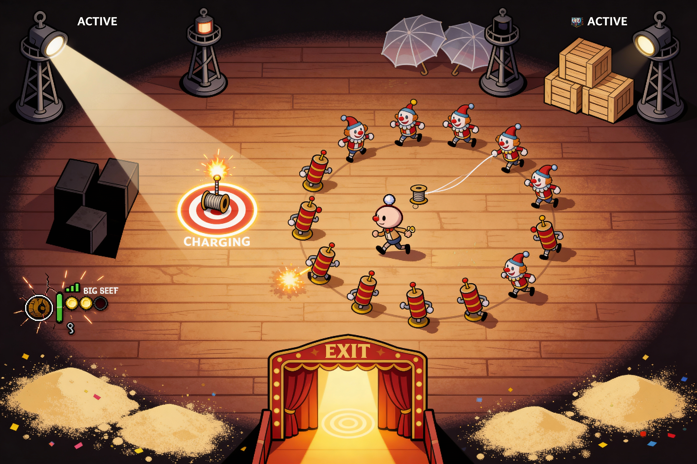

# GDD: Circus vampire-like concept
  дизайн документ для первой версии концепта игры

# 0. Цели создания проекта
  Этот проект - не "главная игра", а тренажёр-полигон перед геймджемами, который должен:
1. Дать команде первый совместный опыт работы "от идеи до web-билда"
2. Проверить пайплайн работы между отделами (код - арт - звук - сборка - страница itch)
3. Собрать переиспользуемый костяк (LamKit) для будущего джема
4. Уложиться в минимальное время на каждого участника

## 0.1 Игровые цели
  1. Игрок в первые 30 секунд понимает:  
	 1.1. что делать  
	 1.2. какой челлендж и энкаунтеры  
	 1.3. зачем нужны разные сущности в игре  
  2. Сессия длится 3-7 минут: есть напряжение, но можно пройти с ростом мастерства
  3. Есть "интересные моменты" за счет:
	 3.1. Боевки  
	 3.2. Интерактивных элементов и мини-пазлов  

## 0.2 Технические цели 
1. Экспорт в Web + стабильный билд на itch
2. Navigation2d / NavMesh для обхода препятствий ai-сущностями
3. Система данных / конфигов
4. Основа архитектуры JamKit
   4.1. Player Controller
   4.2. Health/Damage system
   4.3. Spawner
   4.4. EnemyAI
   4.5. Ability system
   4.6. Objectives
   4.7. UI
   4.8. Audio routing / FMOD integration
   4.9. Sprite Animating pipeline

## 0.3 Критерии успеха
Проект считается успешным, если:
1. Базовый блок проекта сделан до дедлайна 1 февраля 2025
2. Web-версия запускается на itch "в один клик"
3. Есть полный цикл: старт -> игра -> обжективы -> победа/смерть -> рестарт
4. Враги спавнятся, атакую, проигрывают анимации и звуки, корректно работают их системы
5. Интерактивные элементы работают корректно
6. В проекте соблюдена структура и данные вынесены в конфиги для быстрой настройки баланса

# 1. Основной концепт игры
Жанр: 2D topdown survivor-like + objective run
Формат: один уровень/арена, цель — уничтожить якоря и уйти через выход
Платформа: Web (itch, one-click) + опционально Windows zip
Стиль: плоский минимализм, театр/цирк заводных механизмов

## 1.1 Две версии: MVP и Advanced
MVP - делаем базу, кроме Advanced
Advanced - уровни противников, изменение их характеристик и визуала

## 1.2 Идея
Мы — заводная кукла/марионетка, оказавшаяся на сцене в момент, когда представление пошло не так. На сцене работают прожекторы-якоря, удерживающие “режим спектакля” и не дающие занавесу (кулисам) открыться для выхода.

Цель забега: выключить (сломать) 3 прожектора-якоря → открыть выход в кулисы → добежать до выхода.

## 1.3 Кор-геймпелей (цикл/сессия)
1. Персонаж игрока появляется на спавне - выход из-за кулис
2. Ожидаем когда игрок начнет перемещаться на [wasd] / [LStick]
3. За границей экрана начинают спавниться враги 
4. Персонаж игрока выживает, убивая противников получает опыт, усиливается
5. Игрок находит якоря-прожекторы, персонаж уничтожает их
6. После уничтожения 3 прожекторов активируется выход (кулисы на спавне открываются)
7. Игрок пробирается к выходу и завершает игру

## 1.4. Фишка
Парная абилка - хлопушки: "Манежная" (красная) и "Закулисная" (зеленая)
1. Манежная
   - красная
   - цели: только противники
   - помогает выживать и контролить толпу (всегда занята боем)
2. Закулисная
   - зеленая
   - цели: якоря-прожекторы (приоритет) и коробки
   - помогает быстрее разбирать реквизит (всегда занята прогрессом)

# 2. Визуал и логика мира
Мир - сцена театра/цирка, где декорации живут собственной жизнью. Идёт "представление", которое должно закончиться, но его удерживают прожекторы-якоря. Пока якоря активны, занавес (кулисы) не откроется.

## 2.1 Локация (общий вид)
1. Сцена - плоская площадка с ограниченными границами (край сцены / рампа)
2. По сцене разбросан реквизит, ширмы, зонтики, ящики, песочные участки
3. По краям сцены - "вне сцены" (туда нельзя), враги появляются в доступных областях за экраном игрока

## 2.2 Главные сущности (визуальная логика)
1. Персонаж игрока - заводная кукла
2. Враги - ножницы-рА3вР4тНиЦы
   - чиитаемые стадии атаки: замах, удар, восстановление
4. Якоря - прожекторные столбы
   - акцент: столб со световой техникой, четыре прожектора в разные стороны
   - по мере получения урона: отключаются прожекторы
5. Абилка - две хлопушки (красная и зеленая) как "сценический реквизит"
   - акцент: трубка-хлопушка, конфетти
6. Препятствия:
   - "ящики/реквизит" (ломаемые)
   - "тяжёлые блоки/горы" (неподвижные, более тёмные/массивные)
   - "зонтики/ширмы" (как деревья, перекрывают обзор и прозрачнеют)
7. Замедляющие зоны - песок/опилки/сыпучка на сцене
   - акцент: оставляет следы, “вязкое” ощущение

# 3. Игрок (ГГ)
## 3.1 Визуал
- Заводная кукла с простым читаемым силуэтом
- Анимации (минимум для MVP):
  1. idle
  2. run (4 направления)
  3. hit / hurt (можно короткий всплеск/флэш)
  4. death

## 3.2 Управление
1. Перемещение:
   - геймпад: 360° на левом стике
   - клавиатура: WASD, 8 направлений
2. Esc - меню паузы
   - продолжить
   - ползунок общей громкости
   - рестарт
   - выйти из игры

## 3.3 Характеристики и поведение
1. Скорость перемещения: `N1`
   - набирается почти мгновенно (без инерции или с минимальной)
   - может изменяться несколькими модификаторами одновременно (slow, buffs), но не может стать ниже чем N1/2
2. Здоровье:
   - 100 на старте (выходе из-за кулис)
   - при 0 -> смерть -> рестарт
3. Базовая атака:
   - раз в `N2` секунд наносит урон `N3` вокруг игрока по площади (AOE pulse)
   - выглядит как движение руки при "поклоне" - по очереди появляется левая или правая рука, проходя полный круг вокруг персонажа игрок
4. Пассивная абилка:
   - изначально нет
   - после подбора появляется и работает до конца забега
5. Система уровней игрока:
   - стартовый уровень: 1
   - опыт за убийства врагов
   - каждый следующий уровень требует больше опыта (кривая/таблица настраивается в `leveling_lib/mc`)
   - при повышении уровня усиливает игрока одним из:
	 a) увеличивает радиус базовой атаки  
	 b) уменьшает время между базовыми атаками  
	 c) увеличивает скорость перемещения  
   - эффект каждого уровня настраивается в `leveling_lib/mc` (данные, не код)

## 3.4 Коллизии (важные правила)
1. Игрок НЕ сталкивается с противниками (проходит сквозь них)
   - цель: избежать “застреваний” в толпе
2. Урон игроку наносится хитбоксами, но не физическим контактом физтел
3. Игрок сталкивается с препятствиями уровня (ящики, тяжёлые блоки, стойки зонтиков)

# 4. Противник (EnemyRoamer)
## 4.1 Визуал
- ножницы-рА3вР4тНиЦы
- Визуальные состояния:
  1. бег (chase)
  2. замах (windup) - заметная поза/поднятая рука/оружие + короткий предупреждающий звук
  3. удар (strike) - активные кадры атаки
  4. смерть от атаки игрока (death) - разваливается/гаснет

## 4.2 Спавн и движение (MVP)
1. Спавн:
   - в случайном доступном месте за экраном игрока
2. Движение:
   - может двигаться во все стороны, пока позволяет коллизия
   - скорость `N4`, может меняться модификаторами (slow)
3. Навигация:
   - использует `Navigation2D / NavMesh` для обхода препятствий
   - цель: научиться делать навигацию в Godot для джема

## 4.3 Характеристики (MVP)
1. Здоровье на 1 уровне: `N5 ~ 25`
   - показывается красной шкалой над врагом только если здоровье < max
2. Атака ближнего боя:
   - если враг в радиусе атаки `R_melee` от игрока:
	 a) начинает замах на `N6_windup` секунд (телеграф)  
	 b) наносит удар: активные кадры `N_hit_time`, урон `N7 ~ 5` (по игроку)  
	 c) уходит в восстановление на `N_recover` секунд  
	 d) затем снова преследует игрока
   - с момента начала замаха и до конца восстановления противник фиксирует свое направление
3. Опыт:
   - при смерти выдаёт опыт `N11 ~ 50`

## 4.4 Уровни противника (Advanced, не обязательно в MVP версии)
- Перенесено в Advanced-версию
1. Уровень зависит от времени забега и количества уничтоженных якорей:
   - `floor(run_sec*N9 + destroyed_anchors*N10)`
2. Уровень даёт 1 из эффектов (по таблице в `leveling_lib/enemy_roamer`):
   a) увеличение скорости  
   b) уменьшение времени замаха `N6_windup`  
   c) увеличение здоровья  
3. От уровня зависит визуал (переключение визуала в `leveling_lib/enemy_roamer`)
  - например: на 1 уровне все противники зеленые, с 3 уровня становятся желтыми, с 5 уровня - красными

# 5. Элементы уровня
## 5.1 Размер и структура
1. 2D поле фиксированного размера (1 арена)
2. Границы уровня - край сцены (невидимая стена/рампа)
3. На уровне заранее расставлены:
   - 9 потенциальных точек якорей
   - 3 потенциальных точки абилки
   - точка спавна/выхода
   - объекты (границы и препятствия)

## 5.2 Препятствия (визуал + механики)
### 5.2.1 "Ящики" (разрушаемые препятствия)
- Визуал: реквизит, ящики, декорации
- Коллизия: есть (не перекрывают обзор)
- Влияние:
  - блокируют перемещение игрока и противников
  - участвуют в NavMesh (вырезают область или как препятствие)
- Взаимодействие:
  - коробки ломаемые: имеют N~100 здоровья
  - получают урон от: базовой атаки, зеленой хлопушки

### 5.2.2 "Тяжёлые блоки/горы" (неподвижные)
- Визуал: массивные декорационные блоки/контргрузы, темнее и крупнее ящиков
- Коллизия: есть (жёсткая)
- Влияние:
  - не сдвигаются, не разрушаются
  - всегда вырезают NavMesh
- Цель: создать "жёсткие стены" и понятные границы для пазлов/обхода

### 5.2.3 "Зонтики/ширмы" (аналог деревьев)
- Визуал: зонтики, стойки, ширмы
- Логика: восстанавливают по 5 здоровья персонажу игрока в секунду, когда он находится под куполом
- Коллизия:
  - стойка (ствол) имеет коллизию
  - купол/ткань НЕ имеют коллизии, игрок и враги могут заходить “под купол”
- Обзор:
  - купол перекрывает обзор (рисуется поверх персонажей)
  - если игрок находится под/рядом -> купол становится полупрозрачным (alpha fade), чтобы не было нечестно

## 5.3 Замедляющие зоны (песок/опилки)
- Визуал: песок/сыпучка на сцене
- Коллизия: нет
- Эффект:
  - снижает скорость перемещения игрока и противников на `N_water ~ 25%`
  - стакуется с другими slow, но итоговый cap 50%

## 5.4 Пикап абилки
- Визуал: пара хлопушек (красная и зеленая)
- Направление обжектива: со стороны где находится абилка периодически выстреливается кофетти с края экрана
- Спавн:
  - появляется в 1 из 3 заранее отмеченных мест
- Подбор:
  - автоматически при подходе игрока
- После подбора:
  - абилка появляется как спутник вокруг персонажа игрока
  - скрывается обжектив маркер
  - показывается надпись: "Манежная — разгоняет выступление. Закулисная — работает с реквизитом"

## 5.5 "Якорь" (прожектор)
- Визуал: прожекторный столб, 4 прожектора светят в 4 разные стороны
- Направление обжектива: рисуется как свет от прожектора на земле, свет расположен на краю экрана, в направлении к якорю
- Спавн:
  - 3 активных якоря выставляются в 3 случайных местах из 9 заранее подготовленных точек
- Здоровье:
  - `HP = 100 + 200 * destroyed_anchors`
  - при пересечении определенных границ здоровья (95% / 60% / 25% / 0%) выключает по одному прожектору
- когда якорь находится на экране игрока:
  - временное скрытие направления обжектива
- Поведение:
  - неподвижен
  - получает урон от базовой атаки игрока и от зеленой хлопушки
- После уничтожения:
  - увеличивает счетчик уничтоженных якорей
  - отключает отображение обжектива полностью - света прожектора

## 5.6 "Спавн и выход" (кулисы)
- Визуал:
  - спавн: кулисы, из которых появляется кукла
  - выход: занавес/дверь кулис
- Логика:
  - пока есть активные якоря-прожекторы, занавес "закрыт"
  - после уничтожения 3 якорей выход активируется (занавес открывается)
  - после активации выхода усиливается спавн врагов (финальный напор, подробнее в "Кривой сложности")

# 6. Абилка (AbilityPoppers)
После подбора игрок получает две пассивные хлопушки:
- красная (боевое оружие) - "Манежная"
- зелёная (оружие прогресса) - "Закулисная"

## 6.1 Визуал и позиционирование
1. В спокойном состоянии (если нет целей):
   - обе хлопушки крутятся вокруг игрока на расстоянии `R_orbit`
   - в идеале располагаются на противоположных сторонах окружности
   - хлопушки всегда “смотрят” от игрока наружу (направление ствола по касательной/радиусу наружу)

2. Если хлопушка находит цель:
   - она занимает точку на окружности вокруг игрока в направлении к цели (между игроком и целью)
   - поворачивается в сторону цели и начинает стрелять раз в `N_pop_rate` секунд
   - после потери цели возвращается в режим вращения

## 6.2 Поиск целей и приоритет
1. Поиск происходит раз в `N_scan` секунд в радиусе `R_target`, только по line-of-sight
   - тяжёлые блоки/горы блокируют line-of-sight
2. Красная хлопушка:
   - цели: только противники
   - выбирает ближайшего противника к игроку 
3. Зелёная хлопушка:
   - цели: якоря (приоритет), затем коробки
   - выбирает ближайший якорь в радиусе; если якорей нет — ближайшую коробку

## 6.3 Атака (конус)
1. Каждая хлопушка стреляет конусом перед собой:
   - дальность `R_cone`
   - угол `A_cone`
2. Эффекты атаки:
   - все валидные цели этой хлопушки в конусе получают урон
   - красная хлопушка дополнительно отбрасывает противников от игрока
3. Перезарядка:
   - хлопушка становится серой и постепенно востанавливает насыщенность
   - в момент перед выстрелом освещает область в виде конуса цветом хлопушки

## 6.4 Урон и отбрасывание (числа как относительные правила)
1. Базовая атака игрока наносит урон `N3` (база)
2. Красная хлопушка:
   - урон по противникам: `1.5 * N3`
   - урон коробкам и якорям не наносит
   - отбрасывание: `K_push` от игрока (только по противникам)
3. Зелёная хлопушка:
   - урон по якорям и коробкам: `2.0 * N3` (пример)
   - урона противникам не наносит
   - по противникам не стреляет

## 6.5 Правила отбрасывания (ограничения для читабельности)
Отбрасывание не проходит сквозь:
  - край уровня
  - тяжёлые блоки/горы

# 7. Геймплейный цикл (подробнее)
1. Спавн игрока, первые противники
2. Игрок видит направления:
   - на ближайшие якоря (например прожекторный свет в краю экрана в направлении к якорю)
   - на пикап абилки (если ещё не взял)
3. Игрок перемещается, убивает врагов, уклоняется от зарядок/взрывов, используя местность
4. После подбора хлопушек:
   - красная помогает держать дистанцию и отталкивает врагов
   - зелёная ускоряет уничтожение якорей и ломает коробки, упрощая путь
5. Идёт к первому якорю, уничтожает его, параллельно сражаясь
6. После 1-2 якорей врагов становится больше, появляются ситуации “толпа + узкие места”
7. После уничтожения всех 3 якорей:
   - активируется выход (на спавне)
   - усиливается спавн врагов (финальный напор)
8. Игрок добирается до выхода и завершает уровень

# 8. Кастомные ситуации / интересные моменты (варианты раскладки сцены)
1. “Густые кулисы” (аналог густого леса)
   - много зонтиков/ширм, игрок плохо видит бой
2. “Склад реквизита” (аналог каменистого луга)
   - много ящиков и тяжёлых блоков, мало пространства для маневра
3. “Песочная сцена” (аналог затопления)
   - много зон песка/опилок, скорость часто снижается, важны манёвры и управление толпой
4. “Якорь в песке”
   - якорь окружён slow-зоной, прямой подход опасен, удобно работать pull/push
5. “Якорь за декорациями”
   - якорь находится за тяжёлыми блоками, нужно искать проход
6. “Лабиринт из ширм и блоков”
   - игрок часто упирается в тупики, важны маркеры и прозрачность зонтиков

# 9. Кривая сложности
1. Частота спавна противников зависит от количества уничтоженных якорей
   - для каждого `destroyed_anchors = 0/1/2/3` задаётся отдельно
2. (Advanced) при росте времени/якорей растёт уровень противников, что усиливает давление

# 10. UI / читаемость
1. Маркеры за экраном (sidescreen marker):
   - якоря (свет)
   - абилка (если ещё не взята)
   - выход (после активации,свет как от якоря, только красный)
2. UI игрока:
   - HP
   - уровень и полоска опыта
3. UI врага:
   - полоска HP над врагом, показывается только если HP < max
4. UI обжективов:
текст с картинкой в стиле цирка
   - когда поднимаем абилку "Добавлена Вага: управляйте сценой"
   - когда уничтожаем якорь-прожектор: "Уничтожен проектор, зал предвкушает окончание представления"
   - когда открылся выход: "Бурные овации, кулисы открыты"
   - при повышении уровня игроком: "Ваш уровень игры вырос, зрители восхищаются вами"

# 11. Примечания к реализации (JamKit-ориентиры)
1. Все N-параметры лежат в данных/конфигах, не хардкодятся
2. Предпочтительная структура (на уровне идеи):
   - отдельные сцены для: Player, Enemy, Anchor, Ability, Props, UI, Spawner
3. Коллизии:
   - Player проходит сквозь Enemy
   - Damage наносится зонами (AOE) / хитбоксами, а не физическим блоком тел
4. NavMesh:
   - тяжёлые блоки точно вырезают навигацию
   - для MVP лучше избегать динамически перемещаемых препятствий, пока не решён вопрос с обновлением навигации
5. Web билд:
   - стабильный запуск на itch “в один клик” обязателен для DoD
